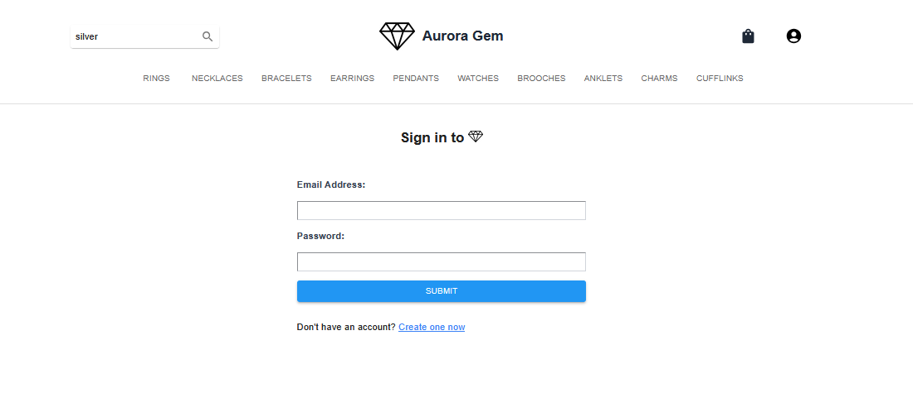
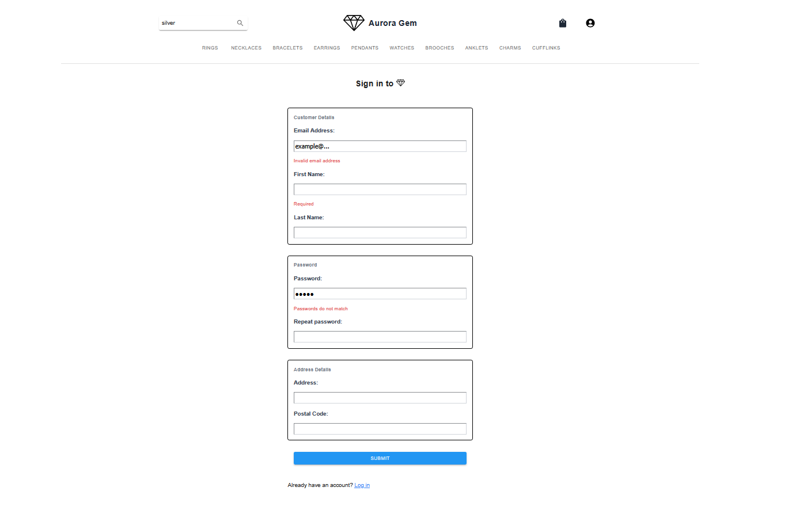
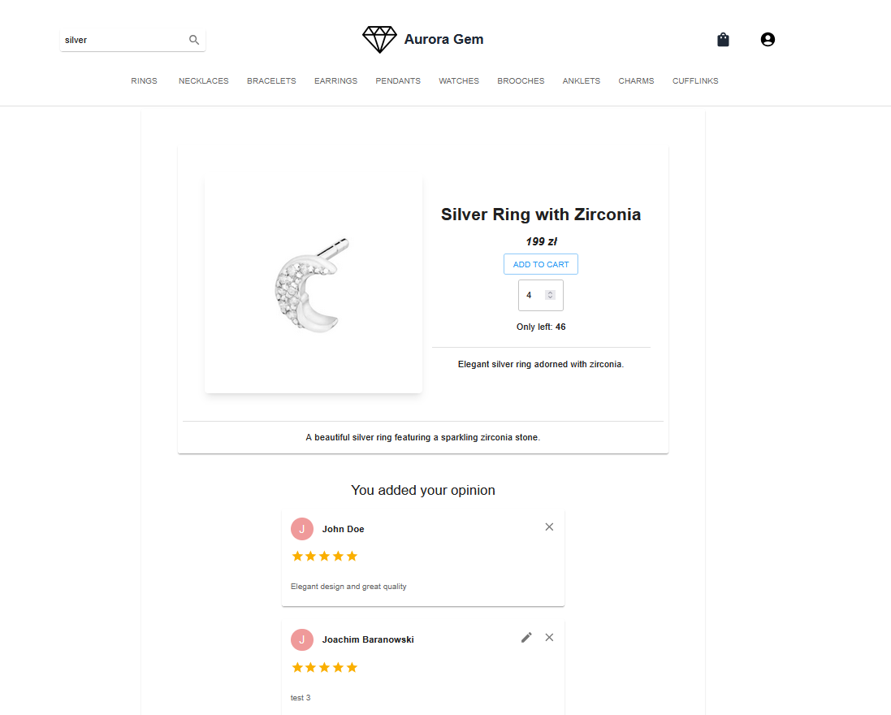
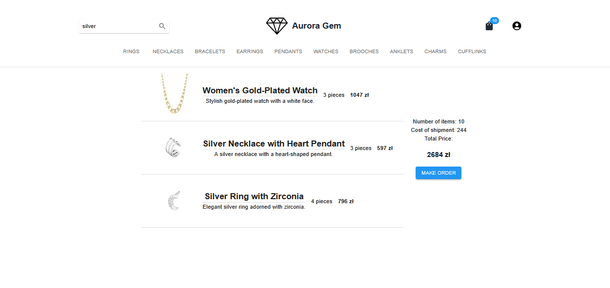
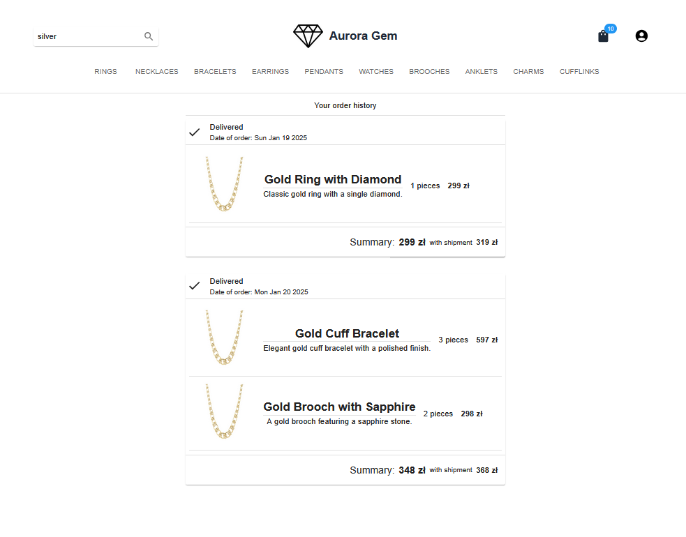

# Aurora Gem - Full Stack Web App

This repository was created for laboratory classes Introduction to Web Applications at AGH UST.

## Api documentation
Postman link to backend api collection: [workspace](https://www.postman.com/sewery/workspace/aurora-gem-api/collection/13527752-92800fc8-df35-42fd-835e-3f00a10d3401?action=share&creator=13527752)

## Screenshots
### Main page

### Login and sign in


JWT bearer token is used for authorization and is stored in the database for a certain period of time.

Passwords are stored in database encrypted using bcrypt
### Product tab

### Product details

A logged-in user can add, edit, and delete their own opinions under each product. The admin can delete all opinions.
### Cart

User can add products to cart to buy them. Only logged one can order them.
### Order history

For logged-in user shows order history with total price.
## Main Technologies
The primary technologies used in this project are:
- **React** 
- **Express**
- **TypeScript (TS)**
- **Material UI**
- **Tailwind**
- **Formik**
- **Docker**

## Prerequisites
To run this project, ensure the following are installed:
- **Docker**
- **npm**
- **Windows** (required as the operating system)

## Api documentation
Postman link to collection: [workspace](https://www.postman.com/sewery/workspace/aurora-gem-api/collection/13527752-92800fc8-df35-42fd-835e-3f00a10d3401?action=share&creator=13527752)

## Setup Instructions
1. Open a terminal and navigate to the project directory.
2. Execute the following commands:

```sh
cd ./backend

docker compose up -d

cd ..

npm run dev
```
## Contributors
- **Seweryn Tasior** ([GitHub Profile](https://github.com/Sewery))
- **Wojtek Pawlina** ([GitHub Profile](https://github.com/Wpawlina))

